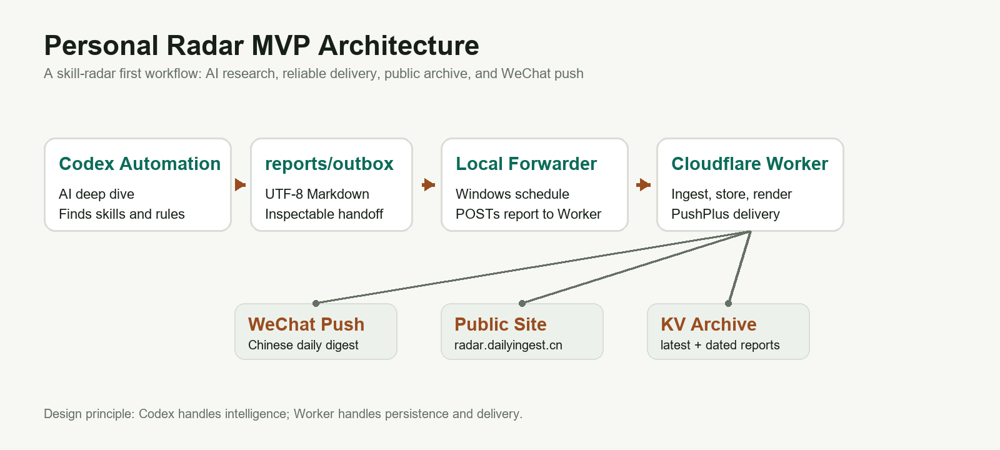
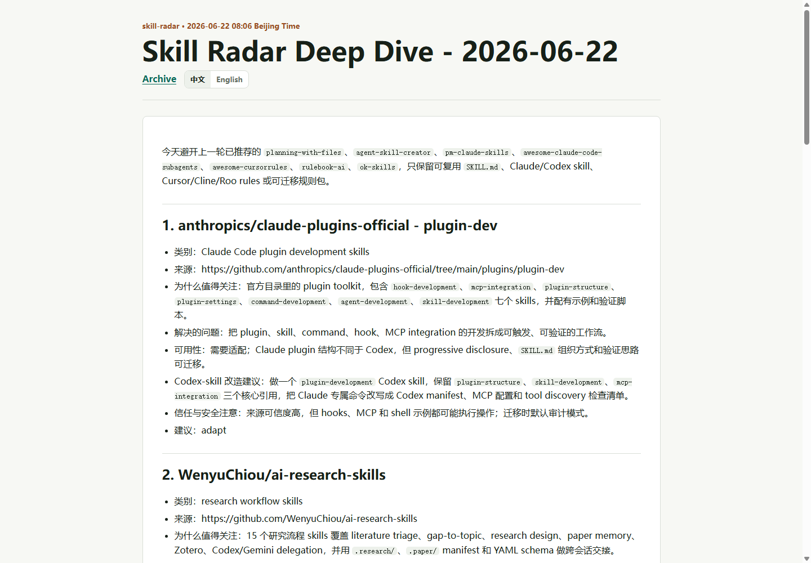
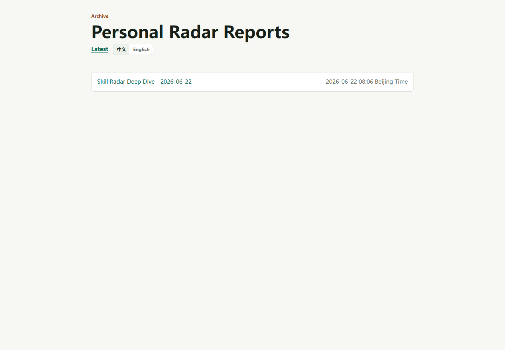

# Personal Radar：从 Skill Radar 切入的 AI 信息雷达产品

> 一个面向 AI 时代信息焦虑的个人雷达 MVP：每天自动发现、筛选、发布并推送值得关注的 AI-agent skills/rules。

- Live Site: <https://radar.dailyingest.cn/>
- GitHub: <https://github.com/jiojioYize/personal-radar>
- 当前阶段：Stage 1 MVP 已完成
- 当前频道：`skill-radar`

## 1. 项目背景：缓解 AI 时代的信息焦虑

AI 工具、agent 框架、Cursor/Cline/Roo rules、Claude/Codex skills 正在快速涌现。对个人来说，真正困难的不是“找不到信息”，而是：

- 信息太分散：GitHub、文档、社区和产品更新散落在不同位置。
- 判断成本高：很多项目看起来热门，但不一定能直接迁移到自己的工作流。
- 复用难沉淀：看过的规则、skills、提示词和实践，很容易停留在一次性收藏。
- 持续跟踪累：每天主动搜索会带来新的时间成本和信息焦虑。

Personal Radar 的初始目标是把这件事产品化：让 AI 自动做高质量搜索和筛选，让系统稳定完成存储、展示和推送，用户只需要在固定时间收到一份可读的雷达日报。

## 2. MVP 切入点：先做 `skill-radar` 频道

第一阶段没有一开始做“大而全的信息平台”，而是先聚焦 `skill-radar` 一个频道。

这个频道关注：

- Codex-native skills 和 `SKILL.md` 工作流。
- Claude / Claude Code skills 与 `CLAUDE.md` 风格指令。
- Cursor rules、`.cursorrules`、Cline/Roo/Roo Code rules。
- 可迁移复用的 AI-agent rule packs。

选择这个切入点的原因：

- 信息更新快，适合日报形态。
- 判断门槛高，需要 AI 帮忙做筛选和解释。
- 和 AI 产品、开发、自动化工作流高度相关。
- 输出可以直接沉淀为可安装、可改造、可观察的行动建议。

## 3. 产品方案：智能生成和可靠投递分层

MVP 的核心链路是：

```text
Codex Automation -> reports/outbox -> local forwarder -> Worker /ingest-report -> KV + public site + PushPlus
```



关键设计不是把所有事情塞进一个脚本，而是把“智能”和“可靠性”拆开：

- Codex Automation 负责智能深挖：搜索、筛选、解释、形成双语 Markdown 报告。
- `reports/outbox` 作为交接层：让自动化结果变成可检查、可重试的文件。
- 本地 forwarder 负责可靠投递：从普通 Windows 计划任务运行，读取 outbox 并 POST 到 Worker。
- Cloudflare Worker 负责产品服务：接收报告、写入 KV、渲染公开网站、推送 PushPlus。
- 网站负责公开沉淀：最新报告、历史归档、中文/英文切换。

这套架构来自一次实际约束：Codex Automation 的智能推荐效果很好，但自动化 shell 的网络出站不稳定；Worker 的推送稳定，但不适合承担复杂 AI 搜索。因此最终选择“Codex 做智能，Worker 做投递和展示”的分层方案。

## 4. 已完成的用户体验

当前 MVP 已经跑通从定时生成到微信触达、公开展示的完整体验：

- 每天北京时间早上由 Codex Automation 生成 `skill-radar` 深挖报告。
- 本地 forwarder 在稍后自动读取报告并发送到 Worker。
- Worker 将报告写入 Cloudflare KV，并更新公开网站。
- PushPlus 将中文报告推送到微信。
- 公开网站支持查看最新报告和历史归档。
- 报告正文支持中文为主，保留英文项目名、仓库名、文件名和命令，降低阅读阻力。





## 5. 关键产品决策

**中文推送，降低阅读阻力。**  
推送到微信的内容默认使用中文，让用户可以在早上快速判断“今天有什么值得关注”。项目名、技术术语和链接保留英文，避免翻译损失。

**公开网站，形成长期沉淀。**  
推送适合即时触达，但不适合回看。公开网站承担“长期归档”和“作品展示”的角色，让日报从一次性消息变成可积累的内容资产。

**中英切换，兼顾理解和溯源。**  
中文帮助快速阅读，英文保留原始技术表达。对于 AI-agent skills/rules 这类强技术内容，中英并存比单纯翻译更稳。

**从单频道验证，不急于多频道扩张。**  
`skill-radar` 先验证信息源、判断标准、报告格式、投递链路和展示体验。多频道扩展放到下一阶段。

## 6. 关键工程决策

**用 outbox 文件替代会话抓取。**  
早期尝试从 Codex session 输出里提取报告，但容易误识别状态文字、日志或格式异常。现在自动化只负责写一个明确的 UTF-8 Markdown 文件，forwarder 只读取这个文件。

**本地 forwarder 解决网络不稳定。**  
Codex Automation 生成质量高，但网络请求不稳定。Windows Task Scheduler 运行的 PowerShell forwarder 更适合做 Worker POST 和失败重试。

**Worker 只做稳定产品能力。**  
Worker 负责 `/ingest-report`、KV 存储、公开页面、PushPlus 推送和受保护的历史清理接口，不承担完整 AI 搜索。

**把编码问题当作产品质量问题处理。**  
报告链路曾出现中文乱码。最终通过 UTF-8 文件读写、JSON UTF-8 bytes、页面 `charset=utf-8`、forwarder 乱码检测来保证内容可读。

## 7. 当前成果

Stage 1 MVP 已完成，稳定起点为 2026-06-22。

已验证结果：

- Codex Automation 能按计划生成 `skill-radar` 报告。
- forwarder 能读取 outbox 并成功投递到 Worker。
- Worker 能写入 KV，并更新公开网站。
- PushPlus 能将中文报告推送到微信。
- 公开归档已从稳定报告开始展示。
- 旧的 Cloud 测试路径和异常历史报告已清理。
- 正文重复时间、中文乱码等展示问题已修复。

这说明项目已经不是一个概念 Demo，而是一条可日常运行的 MVP 链路。

## 8. 项目复盘

这个项目最重要的收获是：AI 产品化不只是让模型“生成内容”，而是要把不稳定的智能能力包装进可靠的工作流。

几个具体体会：

- AI 很适合做开放式搜索、筛选和总结，但不一定适合直接承担所有工程动作。
- 自动化任务的失败点经常不在“模型不会写”，而在权限、网络、编码、调度和状态交接。
- 一个可检查的中间产物比黑盒链路更重要，outbox 文件让问题定位变得直接。
- 作品级项目需要同时考虑用户触达、公开展示、隐私边界和长期维护。

## 9. 下一阶段规划

下一阶段目标是从“能稳定跑的单频道 MVP”，升级为“更像产品的信息雷达”。

计划方向：

- **内容质量**：增加 30 天跨运行去重，记录已推荐链接，减少重复推荐。
- **历史记忆**：让 Codex Deep Dive 能读取历史摘要或链接，避免每天从零开始判断。
- **个性化反馈**：加入“有用/无用”反馈和偏好记忆，逐步调整推荐权重。
- **产品体验**：优化公开归档、分类浏览、搜索、日报版式和移动端阅读体验。
- **可靠性**：增加状态页，展示最后一次生成、投递、推送和网站更新时间。
- **频道扩展**：在 `skill-radar` 稳定后，扩展 AI 产品案例、AI 工具更新、实习/岗位雷达等频道。
- **展示增强**：后续制作 30-60 秒宣传视频，展示“早上收到推送 -> 打开网站查看 -> 浏览历史归档 -> 后续反馈优化”的完整体验。

## 10. 项目链接

- Live Site: <https://radar.dailyingest.cn/>
- GitHub: <https://github.com/jiojioYize/personal-radar>

